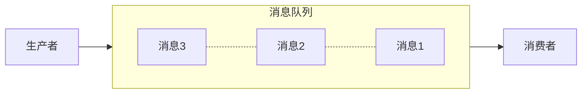
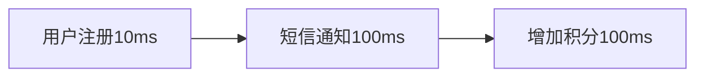
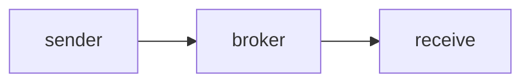
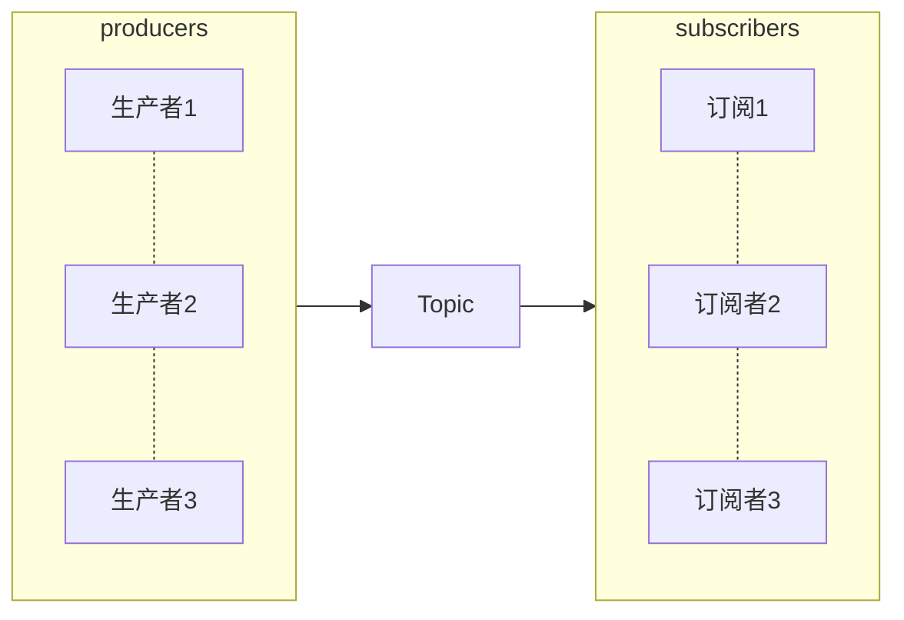

# 消息队列概述
## 1. 什么是消息队列
消息队列（Message Queue，简称MQ）：指保存消息的一个容器，本质是个队列
消息是指在应用之间传送的数据，可以是非常简单的字符串，也可以是复杂的嵌入性对象



## 2. 消息队列应用场景

### 2.1 异步处理

消息队列的主要特点是异步处理，主要目的是减少请求响应时间，实现非核心流程异步化，**提高系统响应功能**
举一个用户注册的例子：一个用户注册成功后，系统需要发送注册成功的短信，以及赠送注册成功的积分
  1. 同步


  同步总耗时 100+100+10 = 210ms，为了提高系统响应性能，可以改成异步

  2. 异步
  ```mermaid
  flowchart LR
  subgraph 异步
  direction LR
  短信通知
  增加积分
  end
      用户注册10ms-->id1[(MQ)]-->异步
  ```
  改造后就变成上图，之前需要等用户注册10ms+短信通知100ms+增加积分100ms才能返回，现在把短信通知和增加积分改为异步的形式，用户注册后写入消息10ms左右立即返回成功给客户端，无需等待耗时较久的同步(短信+积分)就可以返回，从而极大的提升了系统的吞吐量。

### 2.2 应用解耦

使用了消息队列后，只要保证消息格式不变，消息的发送方和接收方并不需要彼此联系，也不需要受对方的影响，即解耦。
每个成员不必受其他成员影响，可以更独立自主，只通过消息队列MQ来联系，典型的上下游解耦如下图所示
```mermaid

  flowchart LR
  subgraph 异步
  direction LR
  下游服务1
  ....
  下游服务n
  end
      上游服务--发送-->id1[(MQ)]-.-异步
  ```

### 2.3 流量削锋

流量削锋是消息队列中的常用场景，一般在秒杀或者团抢活动中使用广泛。
这种场景的系统峰值流量往往集中于一小段时间内，所以为了防止系统被短时间的峰值流量冲垮，往往采用消息队列来削弱峰值流量，相当于消息队列做了一次缓冲

### 2.4 日志处理

日志处理是指将消息队列用在日志处理中，比如Kafka的应用，解决大量日志传输的问题

## 3 消息队列MQ设计

整体架构
```mermaid
flowchart LR
producer--send-->Broker--Recieve-->consumer
```
上图为整体架构，设计三类角色
1. producer消息生产者：负责产生和发送消息到broker
2. broker消息处理中心：负责消息存储、确认、重试等，一般其中会包含多个queue
3. consumer消费者：负责从broker中获取消息，并进行相应处理

详细流程主要是producer发送给broker，broker发送给consumer，consumer回复消费确认，broker删除/备份消息等
1. RPC通信
producer生产消息向broker发送会涉及到通信的问题，同样consumer消费消息也会涉及到通信的问题。Producer,Broker,Consumer最后就通过RPC将数据流串起来了，所以需要解决通信的问题。可以基于Netty 来做底层通信，用Zookeeper、Euraka 等来做注册中心，然后自定义一套新的通信协议。也可以直接利用成熟的 RPC 框架 Dubbo 或者
Thrift 实现即可，这样不需要考虑服务注册与发现、负载均衡、通信协议、序列化方式等一系列问题了。
2. Broker存储
消息到达服务端后需要存储到Broker。流量削峰、最终一致性等需求都是需要Broker先存储下来，然后选择时机投递，这才达到流量削峰、泄洪的目的，所以Broker一个非常重要的功能就是存储。存储可以做成很多方式，比如存储在内存里，存储在分布式KV里，存储在磁盘里，存储在数据库里等等，存储的选型需要综合考虑性能/高可用和开发维护成本等诸多因素。目前主流的方案 追加写日志文件（数据部分）+ 索引文件的方式，索引设计上可以考虑稠密索引或者稀疏索引，查找消息可以利用跳转表、二份查找等，还可以通过操作系统的页缓存、零拷贝等技术来提升磁盘文件的读写性能。
3. 消费模型
消息到达Broker后，最终还是需要Consumer去消费消息，这里就会涉及到到消费模型。这里的消费模型，目前主要就两种：单播和广播。所谓单播，就是点到点；而广播，是一点对多点。详细的单播和广播消费模型
4. 高级特性
如果Consumer端把消息消费了，除了需要消息确认，还会涉及到比如：重复消息、顺序消息、消息延迟、事务消息等需要考虑的高级特性

## 4. 消息队列MQ模型

消息队列MQ主要包括两种类型：点对点和订阅发布模型

### 4.1 点对点模型


点对点模式用于消息生产者和消息消费这之间点到点的通信，包含三个角色
1. 消息队列
2. 发送者
3. 接收者

每个消息都被发送到一个特定的队列，接收者从队列中获取消息。队列保留着消息，可以放在内存中也可以被持久化，直到他们被消费或超时
特点：
1. 每个消息只有一个消费者（即一旦被消费，消息就不再在消息队列中）
2. 发送者和接收者之间在时间上没有依赖性
3. 接收者在成功接收消息之后需要向队列应答成功

### 4.2 发布订阅模型Topic


发布订阅模型包含三个角色
1. 主题
2. 发布者
3. 订阅者

多个发布者将消息发送到topic，系统将这些消息传送给多个订阅者
特点：
1. 每个消息可以有多个消费者，和点对点方式不同，发布消息可以被所有订阅者消费
2. 发布者和订阅者有时间上的依赖性
3. 针对某个主题（Topic）的订阅者，它必须创建一个订阅者之后，才能消费发布者的消息
4. 为了消费消息，订阅者必须保持运行的状态

## 5. 消息队列的缺点

1. 增加了系统的复杂度、幂等、重复消费、消息丢失等问题
2. 系统可用性降低，mq的故障会影响系统可用
3. 一致性、消费端可能失败

使用场景：日志采集、发布订阅等

## 6. 消息队列如何保证不被重复消费
在消息传递过程中，如果出现传递失败的情况，发送会执行重试，重试可能会产生重复的消息。对系统来说，如果没有对重复消费进行处理，会导致系统数据发生错误
比如，一个订单系统，订单创建成功后，把数据写入统计数据库，如果发生重复统计，会导致数据库数据错误
解决消息重复消费，其实就是保证消息的消费幂等性
幂等性就是： 多次执行所产生的影响均与一次执行的影响相同，所以需要从业务逻辑上设计，将消费的业务逻辑设计成幂等性。
 解决方式：
 1. 利用数据库的唯一约束： 在进行消息消费们需要去一个唯一标识，比如id作为唯一约束字段，先添加数据，如果添加失败，后续做错误提示，或者不做后续操作
 2. Redis的set具有天然幂等性
 3. 唯一全局id：让生产者发送每条数据的时候，里面加一个全局唯一的 id，类似订单 id 之类的东西，然后你这里消费到了之后，先根据这个 id 去查一下，之前有没有消费过

## 7. 主流的消息队列对比
1. ActiveMQ：支持JMS规范，支持事务，支持XA协议，没有生产大规模支撑场景，官方维护越来越少
2. RabbitMQ：基于erlang语言开发，性能好、高并发，支持多种语言，社区、文档方面有优势，erlang语言不利于Java语言二次开发，依赖于开源社区的维护和升级，学习成本比较高
以上两个吞吐量都在万级
3. Kafka： 高性能，高可用，生产环境有大规模使用场景，单机容量有限（超过64分区相应会明显变长），社区更新慢
吞吐量单机百万
4. RocketMQ：Java实现，方便二次开发，设计参考了kafka，高可用，高可靠，支持语言较少，吞吐量单机十万
