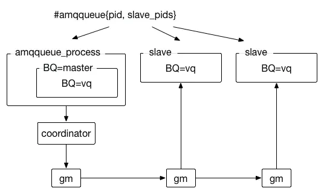

# RabbitMQ
## 1. RabbitMQ架构设计


producer：生产者发送消息的时候会有一个routerKey，就是图中的binding，确定消息发送到哪个队列

Broker：标识消息队列服务器实体rabbitmq-server

Exchange：交换器用来接收生产者发送的消息并将这些消息路由给服务器中的队列，和队列的关系可以是多对多的关系

Queue： 消息队列，用来保存消息直到发送给消费者。它是消息的容器，也是消息的终点。一个消息可投入一个或多个队列。消息一直在队列里面，等待消费者连接到这个队列将其取走

Banding：绑定，用于消息队列和交换机之间的关联。一个绑定就是基于路由键将交换机和消息队列连接起来的路由规则，所以可以将交换器理解成一个由绑定构成的路由表

Channel：信道，多路复用连接中的一条独立的双向数据流通道。信道是建立在真实的TCP连接内地虚拟链接，AMQP命令都是通过信道发出去的，不管是发布消息、订阅队列还是接收消息，这些动作都是通过信道完成。因为对于操作系统来说，建立和销毁TCP都是非常昂贵的开销，所以引入了信道的概念，以复用一条TCP连接

Connection：网络连接，比如一个TCP连接。

consumer：消费者，可以主动去获取消息，也可以由MQ发送，被动接收
## 2. RabbitMQ交换机类型
交换器会先找出绑定的队列，然后再判断routerKey，来决定是否将某一个消息分发到某一个队列中
1. fanout：扇形交换机，不再判断routerKey，直接将消息发送到所有绑定的队列
2. direct：判断routerKey的规则是完全匹配模式，发送消息指定的routerKey等于要绑定的routerKey
3. topic：判断routerKey的规则时模糊匹配模式，比如routerKey为“li*”,，可以匹配"lisi","lishi"
4. header：  不处理路由键。而是根据发送的消息内容中的headers属性进行匹配。在绑定Queue与Exchange时指定一组键值对；当消息发送到RabbitMQ时会取到该消息的headers与Exchange绑定时指定的键值对进行匹配；如果完全匹配则消息会路由到该队列，否则不会路由到该队列。headers属性是一个键值对，可以是Hashtable，键值对的值可以是任何类型。而fanout，direct，topic 的路由键都需要要字符串形式的。
匹配规则x-match有下列两种类型：
  x-match = all ：表示所有的键值对都匹配才能接受到消息
  x-match = any ：表示只要有键值对匹配就能接受到消息
## 3.RabbitMQ持久化机制
主要包含三个方面的持久化

1. 交换机持久化
2. 队列持久化
3. 消息持久化

append的方式写文件。会根据文件的大小自动切割文件，rabbitMQ创建时会创建两个进程，一个负责消息持久化的存储，另一个负责非持久化消息的存储（内存不够时）

消息存储时会在ets表中记录消息在文件中的映射以及相关信息（包括id、偏移量、有效数据、左边文件、右边文件），消息读取时根据该信息到文件中读取，同时更新信息

消息删除时只从ets表中删除，变为垃圾数据，当垃圾数据超出比例（默认50%），并且文件数达到三个，触发垃圾回收，锁定左右两个文件，整理左边文件有效数据、将右边文件有效数据写入左边，更新文件信息，删除右边，完成合并，当一个文件的有用数据等于0时，删除该文件

写入文件前先写buffer缓冲区，如果buffer已满，则写入文件（此时只是操作系统的页存）

每隔25ms刷一次磁盘，不管buffer满没满，都将buffer和页存中的数据落盘

每次消息写入后，如果没有后序写入请求，则直接刷盘

## 4. RabbitMQ事务消息机制
RabbitMQ中与事务机制有关的方法有三个：txSelect(), txCommit()以及txRollback(), txSelect用于将当前channel设置成transaction模式，txCommit用于提交事务，txRollback用于回滚事务，在通过txSelect开启事务之后，我们便可以发布消息给broker代理服务器了，如果txCommit提交成功了，则消息一定到达了broker了，如果在txCommit执行之前broker异常崩溃或者由于其他原因抛出异常，这个时候我们便可以捕获异常通过txRollback回滚事务了。

事务机制类似于数据库的事务机制

生产者
```Java

public class Send {
    private static final String QUEUE_NAME = "QUEUE_simple";

    public static void main(String[] args) throws IOException, TimeoutException {
         /* 获取一个连接 */
        Connection connection = ConnectionUtils.getConnection();
        /* 从连接中创建通道 */
        Channel channel = connection.createChannel();
        channel.queueDeclare(QUEUE_NAME, false, false, false, null);
        String msg = "Hello  Simple QUEUE !";
        try {
            channel.txSelect();
            channel.basicPublish("", QUEUE_NAME, null, msg.getBytes());
            int result = 1 / 0;
            channel.txCommit();
        } catch (Exception e) {
            channel.txRollback();
            System.out.println("----msg rollabck ");
        } finally {
            channel.close();
            connection.close();
        }
    }
}
```
消费者
```Java
public class Recover {
    private static final String QUEUE_NAME = "QUEUE_simple";
    public static void main(String[] args) throws Exception {
        Connection connection = ConnectionUtils.getConnection();
        Channel channel = connection.createChannel();
        channel.queueDeclare(QUEUE_NAME, false, false, false, null);
        DefaultConsumer consumer = new DefaultConsumer(channel) {
            //获取到达的消息
            @Override
            public void handleDelivery(String consumerTag, Envelope envelope, AMQP.BasicProperties properties, byte[] body) throws IOException {
                String message = new String(body, "UTF-8");
                System.out.println(" [x] Received '" + message + "'");
            }
        };
        //监听队列
        channel.basicConsume(QUEUE_NAME, true, consumer);
    }
}
```
## 5. RabbitMQ如何确保消息的可靠传输
RabbitMQ本身包含三个实体：生产者，MQ和消费者，所以消息传输出问题可能会在这三个环节出现问题
### 5.1 生产者投递消息失败
解决这个情况有两种
1. 利用事务机制（即第4节标题提到的）：事务机制可以基本确保生产者投递消息成功，但是这种方式有比较大的缺点，基本上 RabbitMQ 事务机制（同步）一搞，基本上吞吐量会下来，因为太耗性能了
2. confirm机制：针对上述问题，如果还要确保 RabbitMQ 生产者的消息正确投递，可以开启 confirm 模式，在生产者端设置开启 confirm 模式之后，你每次写的消息都会分配一个唯一的 id，然后如果写入了 RabbitMQ 中，RabbitMQ 会给你回传一个 ACK 消息，告诉你说这个消息 ok 了。
如果 RabbitMQ 没能处理这个消息，会回调你一个 nack 接口，告诉你这个消息接收失败，你可以重试。而且你可以结合这个机制自己在内存里维护每个消息 id 的状态，如果超过一定时间还没接收到这个消息的回调，那么你可以重发。
```Java
try {
    channel.confirmSelect(); //将信道置为 publisher confirm 模式
    // 之后正常发送消息
    channel.basicPushlish("exchange", "routingKey", null,
                          "publisher confirm test".getBytes());
    if (!channel.waitFormConfirms()) {
        System.out.println("Send message failed");
    	// do something else...
    } catch (InterruptedException e) {
        e.printStackTrace();
    }
}
```
事务机制和 confirm 机制最大的不同在于，事务机制是同步的，你提交一个事务之后会阻塞在那儿，但是 confirm 机制是异步的，你发送个消息之后就可以发送下一个消息，然后那个消息 RabbitMQ 接收之后会异步回调你一个接口通知你这个消息接收到了。

所以一般生产者到 RabbitMQ 这块避免数据丢失，会采用 confirm 机制更多些。
### 5.2 消息队列（MQ）本身消息丢失
就是 RabbitMQ 自己弄丢了数据，这个你必须开启 RabbitMQ 的持久化，就是消息写入之后会持久化到磁盘，哪怕是 RabbitMQ 自己挂了，恢复之后会自动读取之前存储的数据，一般数据不会丢。除非极其罕见的是，RabbitMQ 还没持久化，自己就挂了，可能导致少量数据丢失，但是这个概率较小。

设置持久化有两个步骤：

创建 queue 的时候将其设置为持久化

这样就可以保证 RabbitMQ 持久化 queue 的元数据，但是不会持久化 queue 里的数据。

发送消息时将消息的 deliveryMode 设置为 2

就是将消息设置为持久化，此时 RabbitMQ 就会将消息持久化到磁盘上去。

必须要同时设置这两个持久化才行，RabbitMQ 哪怕是挂了，再次重启，也会从磁盘上重启恢复 queue，恢复这个 queue 里的数据。

同时持久化也可以跟生产者那边的 confirm 机制配合起来，只有消息被持久化到磁盘后，才会通知生产者 ack 了，所以哪怕是在持久化到磁盘之前，RabbitMQ 挂了，数据丢了，生产者收不到 ACK，你也是可以自己重发的。

注意，哪怕是你给 RabbitMQ 开启了持久化机制，也有一种可能，就是这个消息写到了 RabbitMQ 中，但是还没来得及持久化到磁盘上，结果不巧，此时 RabbitMQ 挂了，就会导致内存中的数据丢失
### 5.3 消费者宕机
对于消费者端所产生的情况就是：消费者成功接收到消息，但是还未将消息处理完毕就宕机了。针对这种情况，可以利用 RabbitMQ 提供的 消息确认机制。

为了保证消息从队列可靠地到达消费者，RabbitMQ 提供了消息确认机制（message acknowledgement）。消费者在订阅队列时，可以指定 autoAck 参数：

当 autoAck 等于 true 时，RabbitMQ 会自动把发送出去的消息置为确认，然后从内存（或者磁盘）中删除，而不管消费者是否真正地消费到了这些消息；
当 autoAck 等于 false 时，RabbitMQ 会等待消费者显示地回复确认信号后才从内存（后者磁盘）中移去消息（实质上是先打上删除标记，之后再删除）。
所以对于消费者可能发生宕机地情况，我们可以将 autoAck 参数置为 false，消费者就有足够的时间处理这条消息，不用担心处理消息过程中消费者进程挂掉后消息丢失的问题，因为 RabbitMQ 会一直等待并且持有这条消息，直到消费者显示调用 Basic.Ack 命令为止。

当 autoAck 参数设置为 false，对于 RabbitMQ 服务端而言，队列中的消息分成了两个部分：一部分是等待投递给消费者的消息，另一部分是已经投递给消费者，但是还没有收到消费者确认信号的消息。如果 RabbitMQ 一直没有收到消费者的确认信号，并且消费此消息的消费者已经断开连接，则 RabbitMQ 会安排该消息重新进入队列，等待投递给下一个消费者，当然也可能还是原来的那个消费者

## 6. 死信队列和延迟队列

### 6.1 死信队列
DLX，全称为Dead-Letter-Exchange,可以称之为死信交换器，也有人称之为死信邮箱。当消息在一个队列中变成死信（dead message)之后，它能被重新被发送到另一个交换器中，这个交换器就是DLX，绑定DLX的队列就称之为死信队列。

以下几种情况会导致消息变成死信：
1. 消息被拒绝（Basic.Reject/Basic.Nack)，并且设置requeue参数为false;
2. 消息过期；
3. 队列达到最大长度。

DLX是一个正常的交换器，和一般的交换器没有区别，它能在任何的队列上被指定，实际上就是设置某个队列的属性。当这个队列中存在死信时，RabbitMQ就会自动地将这个消息重新发布到设置的DLX上去，进而被路由到另一个队列，即死信队列。可以监听这个队列中的消息以进行相应的处理，这个特性与将消息的TTL设置为0配合使用可以弥补immediate参数的功能。

### 6.2 延迟队列
延迟队列用来存放延迟消息。延迟消息：指当消息被发送以后，不想让消费者立刻拿到消息，而是等待特定时间后，消费者才能拿到这个消息进行消费。

在AMQP协议中，或者RabbitMQ本身没有直接支持延迟队列的功能，但是有两种方案来间接实现：

1. 采用rabbitmq-delayed-message-exchange 插件实现。（RabbitMQ 3.6.x开始支持）
2. 通过前面所介绍的DLX和TTL模拟出延迟队列的功能。

生产者通过exchange.normal这个交换器将发送的消息存储在queue.normal这个队列中。消费者订阅的并非是queue.normal这个队列，而是queue.dlx这个队列。当消息从queue.normal这个队列中过期之后被存入queue.dlx这个队列中，消费者就恰巧消费到了延迟10秒的这条消息。

## 7. RabbitMQ的三种集群模式
### 7.1 单机模式
顾名思义就是只启动一个示例，一般生产不会采用这种模式
### 7.2 普通集群模式
就是在多台机器上启动多个rabbitmq实例，每个机器启动一个。

但是你创建的queue，只会放在一个rabbtimq实例上，但是每个实例都同步queue的元数据(存放含queue数据的真正实例位置)。消费的时候，实际上如果连接到了另外一个实例，那么那个实例会从queue所在实例上拉取数据过来（即消息）。

这种方式的缺点是你要么消费者每次随机连接一个实例然后拉取数据，要么固定连接那个queue所在实例消费数据，前者有数据拉取的开销，后者导致单实例性能瓶颈

而且如果那个放queue的实例宕机了，会导致接下来其他实例就无法从那个实例拉取，如果你开启了消息持久化，让rabbitmq落地存储消息的话，消息不一定会丢，得等这个实例恢复了，然后才可以继续从这个queue拉取数据

所以普通集群缺点是不能实现高可用，但是可以提高吞吐量，就是说让集群中多个节点来服务某个queue的读写操作

### 7.3 镜像集群模式

跟普通集群模式不一样的是，你创建的queue，无论元数据还是queue里的消息都会存在于多个实例上，然后每次你写消息到queue的时候，都会自动把消息到多个实例的queue里进行消息同步

这种模式的优点在于：高可用，一个实例宕机，其他的也可以用

缺点在于性能开销比较大，可扩展性比较差（如果某个queue负载很重，你加机器，新增的机器也包含了这个queue的所有数据，并没有办法线性扩展你的queue）

#### 7.3.1 原理

通常队列由两部分组成：一部分是 amqqueue_process, 负责协议相关的消息处理，即接收生产者发布的消息，向消费者投递消息，处理消息 confirm，ack 等等；另外一部分是 backing_queue， 作为消息存储的具体形式和引擎，提供了相关接口供进程amqqueue_process调用，用来完成消息的存储及可能的持久化工作等。

​ 镜像队列和普通队列组成有所不同，镜像队列存在两类进程：master队列进程为 amqqueue_process，slave 队列进程为 rabbit_mirror_queue_slave，每个进程会创建一个 gm（guaranteed multicast）进程，镜像队列中所有 gm 进程会组成一个进程组用于广播和接收消息。同时和普通队列一样，每个进程都包含一个用于处理消息逻辑的队列 backing_queue（默认为rabbit_variable_queue）。集群中每个有客户端连接的节点都会启动若干个channel进程，channel进程中记录着镜像队列中master和所有slave进程的Pid，以便直接与队列进程通信。整体结构如下：



gm 负责消息广播，至于广播消息处理，master 队列上回掉处理是通过coordinator，消息相关协议操作是通过amqqueue_process处理，而 slave 队列都是由rabbit_mirror_queue_slave进行处理。

注意：消息的发布和消费都是通过 master 队列完成，master 队列对消息进行处理同时将消息的处理动作通过 gm 广播给所有 slave 队列，slave 的 gm 收到消息后，通过回调交由 rabbit_mirror_queue_slave 进行实际处理。

#### 7.3.2 GM（Guaranteed Muticast）

​ 镜像队列 gm 组通过将所有 gm 进程形成一个循环链表，每个 gm 都会监控位于自己左右两边的 gm，当有 gm 新增时，相邻的 gm 保证当前广播的消息会通知到新的 gm 上；当有 gm 失效时，相邻的 gm 会接管保证本次广播消息会通知到所有 gm。

​ gm 组信息会记录在本地数据库（mnesia）中，不同的镜像队列行程的 gm 组也是不同的。

​ 消息从 master 队列对应的 gm 发出后，顺着链表依次传送到所有 gm 进程，由于所有 gm 进程组成一个循环链表，master 队列的 gm 线程最终会收到自己发送的消息，这个时候 master 队列就知道消息已经复制到所有 slave 队列了。
