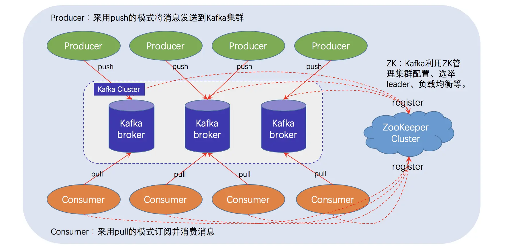
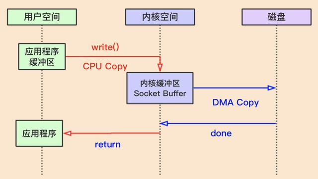
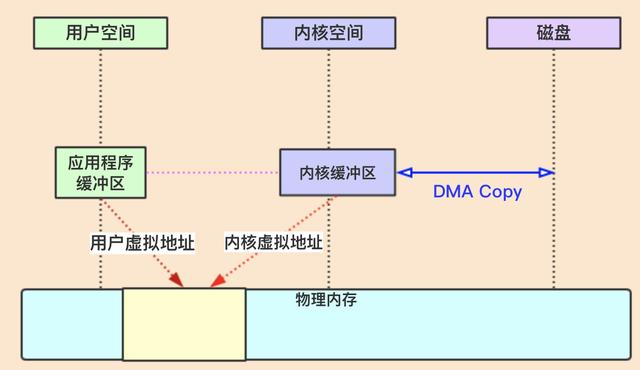
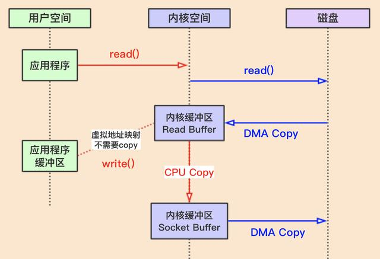

# Kafka
## 1. Kafka架构

### 名词解释
Broker：消息中间件处理节点（服务器），一个节点就是一个broker，一个Kafka集群由一个或多个broker组成

Topic：Kafka对消息进行归类，发送到集群的每一条消息都要指定一个topic

Partition：物理上的概念，每个topic包含一个或多个partition，一个partition对应一个文件夹，这个文件夹下存储partition的数据和索引文件，每个partition内部是有序的

Producer：生产者，负责发布消息到broker

Consumer：消费者，从broker读取消息

ConsumerGroup：每个consumer属于一个特定的consumer group，可为每个consumer指定group name，若不指定，则属于默认的group，一条消息可以发送到不同的consumer group，但一个consumer group中只能有一个consumer能消费这条消息

**Topic & Partition**
一个topic为一类消息，每条消息必须指定一个topic。物理上，一个topic分成一个或多个partition，每个partition有多个副本分布在不同的broker中。

每个partition在存储层面是一个append log文件，发布到此partition的消息会追加到log文件的尾部，为顺序写入磁盘（顺序写磁盘比随机写内存的效率还要高）。每条消息在log文件中的位置成为offset（偏移量），offset为一个long型数字，唯一标记一条消息

每个消费者唯一保存的元数据是offset值，这个位置完全为消费者控制，因此消费者可以采用任何顺序来消费记录
## 2. Kafka高性能高吞吐原因
### 2.1 顺序读写
kafka的消息是不断追加到文件中的，这个特性使kafka可以充分利用磁盘的顺序读写性能。顺序读写不需要硬盘磁头的寻道时间，只需很少的扇区旋转时间，所以速度远快于随机读写
### 2.2 零拷贝
要把磁盘数据发到网络上，传统的方式会经历以下条件
读操作


如上图：操作系统把内存分为了内核空间和用户空间。首先位于用户空间的应用程序使用发起数据读操作，比如 JVM 发起 read() 系统调用。这个时候操作系统会进行一次上下文切换：从用户空间切换到内核空间。

然后内核空间通知磁盘，内核把数据从磁盘 copy 到内核缓冲区。这个过程是由一个叫 “DMA（Direct memory access）” 的硬件来做的，所以不需要 CPU 的参与。

然后内核把我从内核缓冲区 copy 到应用程序缓冲区，这里需要 CPU 的参与。

最后进行上下文切换，又换回到用户空间的上下文。

整个读操作的过程需要两次上下文切换和两次 copy。

写操作



写操作与读操作类似，只是方向相反而已，仍然需要两次上下文切换和两次数据的 copy。数据可能会被写到磁盘，也可能会被写到网卡。

从上面的过程可以看到，如果想把数据从磁盘发送到网卡，需要总共 4 次上下文切换和 4 次 copy 操作。数据被操作系统在内核空间和用户空间之间来回复制，但其实数据在这期间什么也没有做，什么也没有变化，就是复制而已，所以这个 IO 模型太浪费操作系统资源了。

现在主流的操作系统都使用了虚拟内存。简单来说，就是用虚拟地址取代物理地址，这样做可以让多个虚拟内存只想同一个物理地址，虚拟内存的空间可以远远大于物理内存的空间。

那如果操作系统能够把用户空间的应用程序缓冲区和内核空间的内核缓冲区映射到同一个物理地址，那岂不是就少了很多复制的过程？如下图：

所以为了解决这个问题，聪明的 Linux 开发者们写了一些新的系统调用来做这个事。主要有两种方式：

mmap + write
sendfile

**mmap + write**
mmap() 系统调用首先会使用 DMA copy 的方式将数据从磁盘读取到内核缓冲区，然后通过内存映射的方式，使用户缓冲区和内核读缓冲区的内存地址为同一内存地址，也就是说，不需要 CPU 再将数据从内核读缓冲区复制到用户缓冲区啦！

当使用 write() 系统调用的时候，CPU 将数据从内核缓冲区（等同于用户缓冲区）直接写入到需要发送的内核缓冲区，比如网络发送缓冲区（socket buffer），然后通过 DMA 的方式将数据传入到网卡驱动程序（或磁盘）中准备发送。



**sendfile**
sendfile 也是一个系统调用，它其实本质上就是把上述两个系统调用的功能合起来，变成了一个调用。这样做的好处是，操作系统只需要 2 次上下文切换了，减少了 2 次上下文切换的开销。


### 2.3 分区
kafka中的topic中的内容可以被分为多分partition存在,每个partition又分为多个段segment,所以每次操作都是针对一小部分做操作，很轻便，并且增加并行操作的能力

### 2.4 批量发送
kafka允许进行批量发送消息，producer发送消息的时候，可以将消息缓存在本地,等到了固定条件发送到kafka
1. 等消息条数到固定条数
2. 一段时间发送一次
### 2.5 数据压缩
Kafka还支持对消息集合进行压缩，Producer可以通过GZIP或Snappy格式对消息集合进行压缩 压缩的好处就是减少传输的数据量，减轻对网络传输的压力

批量发送和数据压缩一起使用,单条做数据压缩的话，效果不明显

## 3. Kafka rebalance机制

消费者组rebalance过程中，组内消费者会全部停止消费,直到rebalance结束

影响：

1. Rebalance 影响 Consumer 端 TPS。
2. 在 Rebalance 期间，Consumer 会停下手头的事情，什么也干不了。
3. Rebalance 效率不高。当前 Kafka 的设计机制决定了每次 Rebalance 时，Group 下的所有成员都要参与进来，而且通常不会考虑局部性原理，但局部性原理对提升系统性能是特别重要的

Rebalance 发生的时机有三个：
1. 组成员数量发生变化
2. 订阅主题数量发生变化
3. 订阅主题的分区数发生变化

**如何避免rebalance?**

我们已经明确了rebalance 可能出现的原因，那么避免出现rebalance的方法也就明确了

1. 避免组成员发生变化：避免成员增加，在程序设计之初就规划好具体数量的消费者，是谓瞻前顾后。
 避免成员减少，避免消费者进程、线程失活，如果消费者进程与server断开连接，那么消费者组数量也就减少了，会发生rebalance 是谓稳定大于一切

2. 避免订阅主题数量发生变化：这个同1，事先规划好要订阅的topic,后期尽量不要变

3. 订阅主题的分区数发生变化 这个同1，事先规划好分区数,后期尽量不要变
具体代码
```java
//consumer失活时间配置
$conf->set("session.timeout.ms",6*1000);
//consumer 心跳频率
$conf->set("heartbeat.interval.ms",2*1000);
//最佳配置    session.timeout.ms >= 3 * heartbeat.interval.ms
避免消费耗时过长导致 进程失活
//设置poll间隔时间
$conf->set("max.poll.interval.ms",420000);   此配置应该大于消费时间
```
